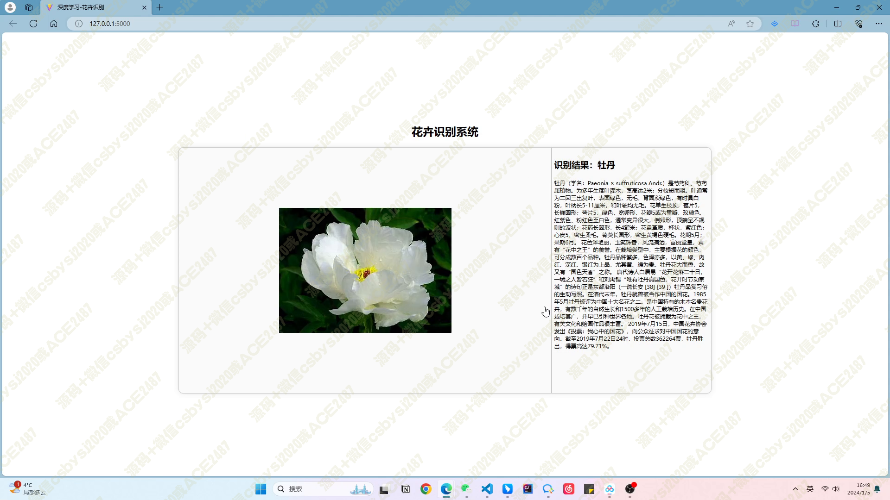
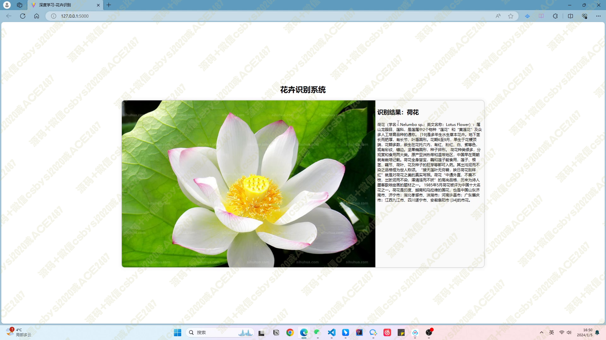
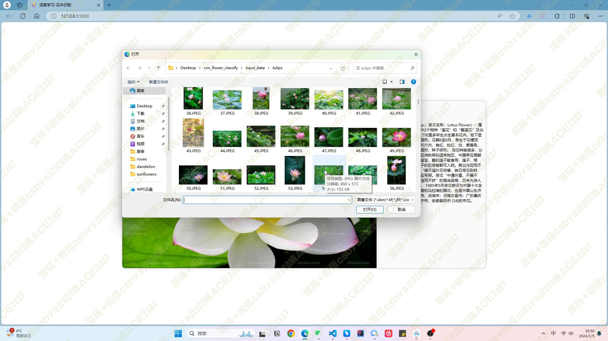
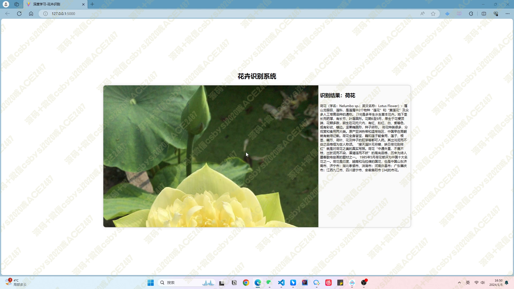
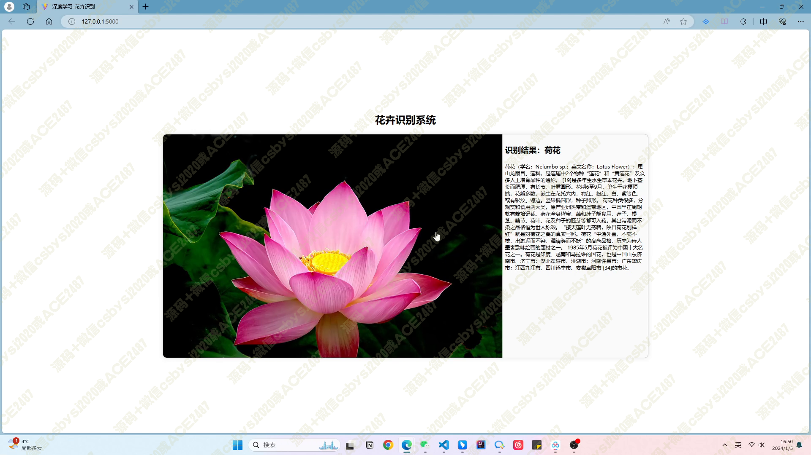
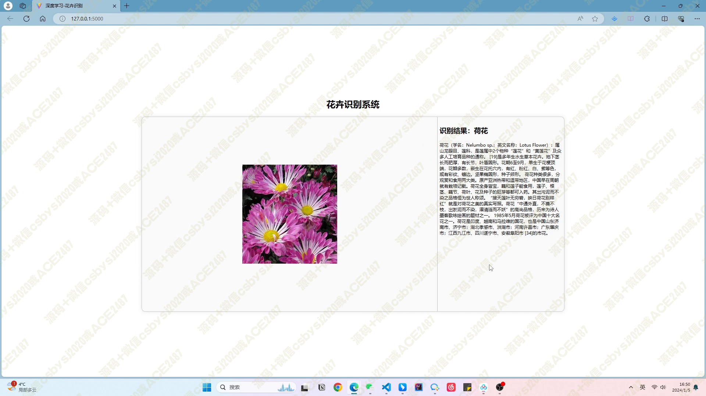
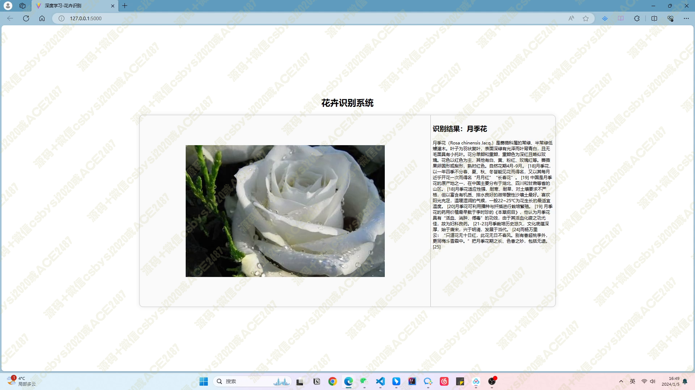
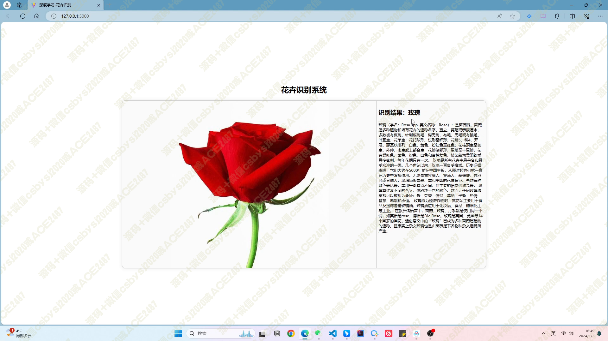
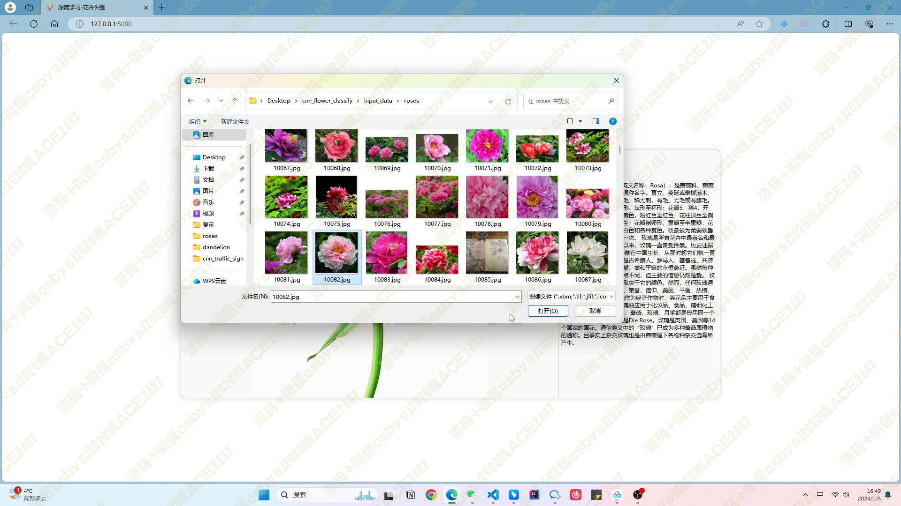

# 038 基于 tensorflow CNN 的花卉识别系统-设计展示

> **代码有偿获取 可接受定制 微信联系方式: csbysj2020 或 ACE2487，备注(BS)**

> 

> 

## 项目介绍：

本项目是一个基于深度学习技术的花卉识别系统。用户可以上传一张花卉图片，系统通过使用卷积神经网络（CNN）模型，自动识别出该花卉的品种。系统采用 Python 编程语言和 TensorFlow 框架进行开发，前端界面使用 React 和 Ant Design 实现，后端使用 Flask 框架搭建 Web 服务。通过该系统，用户可以方便地获取花卉的品种信息，并可以对系统进行反馈和改进。

## 技术栈：

- Python：作为主要编程语言，用于系统的后端开发和模型训练。
- TensorFlow：作为深度学习框架，用于构建和训练卷积神经网络模型。
- Flask：用于搭建后端 Web 服务，接收用户上传的花卉图片，并返回识别结果。
- React：作为前端框架，用于构建用户友好的界面，实现图片上传和展示识别结果等功能。
- Ant Design：作为 React 的 UI 组件库，提供美观且易于使用的界面组件。

## 技术架构：

1. 数据集采集与预处理：从公开的花卉数据集中获取 17 个品种、1360 张花卉图片。对这些图片进行预处理，包括缩放、裁剪和归一化等操作，以满足 CNN 模型的输入要求。同时，使用数据增强技术生成更多的训练数据，提升模型的泛化能力。
2. CNN 模型训练与优化：使用 TensorFlow 框架搭建基于 VGGNet 的 CNN 模型。通过微调和优化，将 VGGNet 的全连接层替换为适合花卉识别任务的新输出层，并固定前几层的权重，只更新后几层的权重。使用 Adam 优化算法进行模型参数更新，并根据验证集上的准确率和损失函数来调整超参数和训练策略，提高模型性能和泛化能力。
3. Web 服务开发：使用 Flask 框架搭建后端 Web 服务，接收用户上传的花卉图片，并调用 CNN 模型进行图像分类。通过 API 将识别结果返回给前端界面，使用 React 和 Ant Design 实现用户友好的界面，包括图片上传和显示识别结果等功能。同时，实现用户反馈功能，以进一步优化系统性能。

## 系统流程：

1. 用户上传花卉图片至前端界面。
2. 前端界面将图片发送至后端 Web 服务。
3. 后端 Web 服务接收图片并进行预处理。
4. 调用 CNN 模型对预处理后的图片进行分类。
5. 后端 Web 服务将识别结果返回给前端界面。
6. 前端界面展示识别结果，并提供用户反馈功能。

## 视频

> **点击查看 \>\>\> [https://www.bilibili.com/video/BV1Wc41187YN/](https://www.bilibili.com/video/BV1Wc41187YN/)**

## 截图

